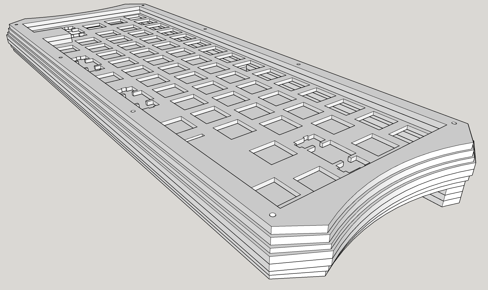

# Phở Bòard


## Case & Plate

Download .skp and .dxf [here](case_plate.zip)



Updating ...

## Materials

Material | Quantity
---|---
SparkFun Pro Micro 5V/16MHz | 1
Any MX Style Switch | 62
1N4148 Diode | 62
2U Stabilizer | 4
SSD1306 OLED 128x32 | 1

## Wiring

[KLE](http://www.keyboard-layout-editor.com/#/gists/4cfd5da9ece87a8a6bd2f5c80a84bed2)

Updating ...

## Firmware & Flashing

Put the Pro Micro into bootloader mode by connecting RST and GND pins together 1 or 2 times depending on the board

### Using QMK Toolbox

[Download QMK Toolbox](https://github.com/qmk/qmk_toolbox/releases)

[Download .hex file](frostbun_phoboard_vial.hex)

Updating ...

### Build from source

Clone my fork of [Vial](https://github.com/frostbun/vial-qmk)
```bash
git clone https://github.com/frostbun/vial-qmk.git
```

Cd into the directory
```bash
cd vial-qmk
```

Install dependencies
```bash
sh util/qmk_install.sh
```

Clone the submodules
```bash
make git-submodule
```

Compile & flash the firmware
```bash
make frostbun/phoboard:vial:flash
```

## Keymap

[Download Vial](https://get.vial.today/download/) or [Start Vial Web](https://vial.rocks/)

**Enjoy!**
